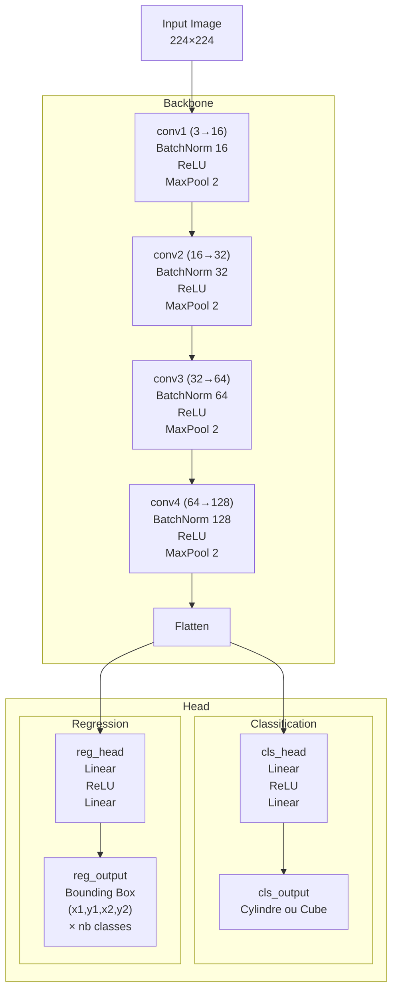

## YOLOvsCustomCNN

The goal of this project was to conduct a supervised learning performance audit comparing YOLO and a custom CNN.
         

## Model architecture

## 3D localisation

## Software

## Resources

- [Documentation YOLOv11](https://docs.ultralytics.com/models/yolo11/)
- [Tutoriel OpenCV Calibration](https://docs.opencv.org/4.x/dc/dbb/tutorial_py_calibration.html)
- [Cours Deep Learning](https://melodiedaniel.github.io/deep_learning/)
- [Label Studio](https://labelstud.io/guide/)

## Contributors 
- Mathieu Jay (CNN development)
- Anh Tin Nguyen (3D localisation)
- Elias Gauthier (Software architecture & GUI)
