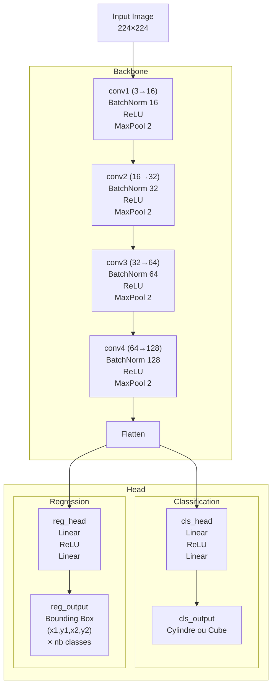

[](https://www.kaggle.com/datasets/mrpoulpe/cubes-and-cylinders)

## YOLOvsCustomCNN


The goal of this project was to conduct a supervised learning performance audit comparing YOLO and a custom CNN.
In order to benefit from 3D localisation of elements,  it is necessary to have a RealSense camera.

Dataset is available on [Kaggle](https://www.kaggle.com/datasets/mrpoulpe/cubes-and-cylinders/data).

<br><br><br><br><br><br><br>

## Model architecture


## 3D localisation

Detected objects are located in 3D using an Intel RealSense depth camera and an ArUco marker as world reference. The bounding box center is deprojected to 3D camera coordinates, then transformed to world coordinates via `solvePnP`.

## Software

PyQt6 desktop app with three tabs: **Detection** (real-time inference), **Training** (model training), and **Calibration** (camera calibration via chessboard). All paths and parameters are configured in `config.ini`.

The two main modules are ModelManager, which enables efficient management of model inference, and RealSense, which enables acquisition of the various camera streams via an optimised pipeline.


## Comparisons

### IoU and confusion matrix

| Model | Results |
|:-----:|:-------:|
| **Custom CNN** |  |
| **YOLO** |  |

### Classification

| Model | Results |
|:-----:|:-------:|
| **Custom CNN** |  |
| **YOLO** |  |


## Run

```bash
git clone https://github.com/elias-utf8/YOLOvsCustomCNN.git
cd YOLOvsCustomCNN
uv sync
uv run python app.py
```

## Resources

- [Documentation YOLOv11](https://docs.ultralytics.com/models/yolo11/)
- [Tutoriel OpenCV Calibration](https://docs.opencv.org/4.x/dc/dbb/tutorial_py_calibration.html)
- [Cours Deep Learning](https://melodiedaniel.github.io/deep_learning/)
- [Label Studio](https://labelstud.io/guide/)

## Contributors 
- [Mathieu Jay](https://github.com/Arkww) (CNN development)
- [Anh Tin Nguyen](https://github.com/atnguyen14) (3D localisation)
- [Elias Gauthier](https://github.com/elias-utf8) (Software architecture & GUI)
